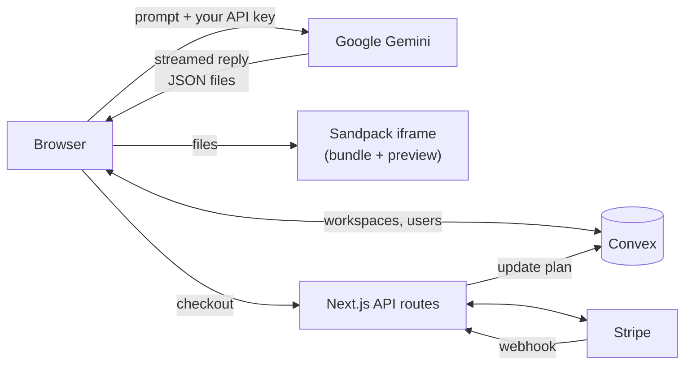

<div align="center">

# CodePilot

**Describe an app in plain English and get a running React project, with a live editor and preview in the browser.**

[Live demo](https://codepilot-pro.vercel.app) · [Architecture decisions](doc/architecture_decisions.md) · [Configuration guide](doc/configuration_guide.md)


</div>

---

## About

CodePilot is a prompt-to-app workspace in the style of Bolt.new. You describe what you want, such as "an expense tracker with a monthly chart", and Google Gemini writes a multi-file React project. The project runs immediately in a CodeSandbox Sandpack editor and preview. Follow-up prompts edit the same project, and every workspace is saved to your account.

It uses **your own Gemini API key**. The key stays in your browser and goes straight to Google, never through CodePilot's servers.

## Features

- **Prompt or starter template:** start from a blank prompt or one of 8 templates (todo, dashboard, landing page, portfolio, quiz, expense tracker, weather and more).
- **Streaming assistant reply:** a short explanation streams into the chat while the code is generated alongside it.
- **Multi-file React output:** an `App.js` plus `components/` and `utils/`, styled with Tailwind. Common libraries are preinstalled: lucide-react, react-router-dom, chart.js, date-fns and others.
- **Iterate in place:** follow-up prompts get the current files and recent chat as context, so Gemini edits the project instead of starting over.
- **Full workspace:** file explorer, editor tabs, live preview and a toggleable console, in a **split** or a **floating** chat layout.
- **Share and export:** copy a read-only preview link (`/preview/<id>`) or download the files as a ZIP.
- **Dashboard:** all your workspaces with auto-generated titles, which you can rename or delete.
- Google sign-in, light/dark/system theme, and clear messages when you hit Gemini's rate limits.

## How it's built

- **Bring your own key, with no proxy.** `hooks/useApiKey.js` keeps the Gemini key in `localStorage` and passes it to `@google/genai` for each call from the browser (`lib/ai.js`). No API route or Convex function ever receives it. Generated code runs in Sandpack's iframe, which is on a different origin and can't read the key.
- **Two model calls per prompt, each with its own job.** `gemini-2.5-flash` streams a short reply (under 15 lines, no code) for quick feedback. A second call in **JSON mode** returns `{ files: { path: { code } } }`, which is parsed, checked, and written into the workspace.
- **Context for edits.** Follow-up prompts send the current source files (each cut to 3,000 characters) and the last 6 chat turns, with instructions to make targeted edits.
- **Keeping the preview valid.** The system prompt spells out the file layout Sandpack's Create React App template expects: no `/src`, no `package.json`, and `index.js` and `public/index.html` left alone. A path normalizer enforces the same rules on whatever comes back, so a stray `src/` prefix can't break the preview.
- **The logic lives in hooks.** `useWorkspace`, `useCodeGeneration`, `useCreateWorkspace` and `useApiKey` hold the behaviour, and components only render. `lib/ai.js` is the one place to swap AI providers.
- **Stripe subscription flow (built, not enabled on the demo).** Card details are collected with Stripe Elements and a SetupIntent. The subscription is created in the webhook (`app/api/stripe/webhook/route.js`), and Convex updates the user's plan from the webhook events. A SetupIntent is used because Thai Stripe accounts don't return a PaymentIntent for incomplete subscriptions.

## Tech stack

| Layer | Technology |
|---|---|
| App | Next.js 15 (App Router), React 19, JavaScript |
| AI | Google Gemini 2.5 Flash via `@google/genai` (streaming + JSON mode) |
| Editor & preview | CodeSandbox Sandpack (React template, Tailwind via CDN) |
| Data | Convex (users and workspaces) |
| Auth | Google OAuth (`@react-oauth/google`) |
| UI | Tailwind CSS 4, shadcn/ui (Radix), lucide-react, next-themes, sonner |
| Payments | Stripe (Elements, SetupIntent, webhooks) |
| Tests | Jest, React Testing Library |
| Hosting | Vercel + Convex Cloud |

## Architecture



The pages are client components. The Next.js server only runs the three Stripe routes (checkout, webhook, billing portal), and Convex stores users and workspaces.

## Getting started

**Prerequisites:**
- Node.js 18.18+
- a [Convex](https://convex.dev) account
- a Google OAuth "Web application" client with `http://localhost:3000` as an authorized JavaScript origin
- a Gemini API key from [Google AI Studio](https://aistudio.google.com/app/apikey), which you paste into the app (it is not an environment variable)

```sh
npm install
npx convex dev        # links a deployment, writes CONVEX_DEPLOYMENT and NEXT_PUBLIC_CONVEX_URL to .env.local; keep it running
# add NEXT_PUBLIC_GOOGLE_CLIENT_ID to .env.local
npm run dev           # in a second terminal → http://localhost:3000
```

| Variable | Required | Purpose |
|---|---|---|
| `NEXT_PUBLIC_CONVEX_URL` | yes | Convex deployment URL (written by `npx convex dev`) |
| `NEXT_PUBLIC_GOOGLE_CLIENT_ID` | yes | Google OAuth client ID |
| `STRIPE_SECRET_KEY` | billing only | Stripe secret key |
| `NEXT_PUBLIC_STRIPE_PUBLISHABLE_KEY` | billing only | Stripe publishable key |
| `STRIPE_PRO_PRICE_ID` | billing only | Price ID of the Pro plan |
| `STRIPE_WEBHOOK_SECRET` | billing only | Signing secret of the webhook endpoint |
| `NEXT_PUBLIC_APP_URL` | billing only | Base URL used for Stripe return and portal links |

To test billing locally, run `stripe listen --forward-to localhost:3000/api/stripe/webhook`. It needs three events: `setup_intent.succeeded`, `invoice.paid` and `customer.subscription.deleted`.

**Scripts:** `npm run dev`, `npm run build`, `npm start`, `npm run lint`, `npm test`.

## Deployment

The app is deployed on Vercel. To set up your own deployment:
1. Run `npx convex deploy` (or set `CONVEX_DEPLOY_KEY` in Vercel).
2. Set `NEXT_PUBLIC_CONVEX_URL` and `NEXT_PUBLIC_GOOGLE_CLIENT_ID` in Vercel.
3. Add the production URL to the Google OAuth client's authorized origins.

## Project status

CodePilot is a working portfolio project. Prompting, generation, the editor and preview, sharing, ZIP export and the dashboard all work on the [live demo](https://codepilot-pro.vercel.app). Known gaps:

- **Auth hardening:** Convex functions aren't yet tied to the Google sign-in, so ownership checks happen on the client. Connecting Convex auth to Google is the next step.
- **Billing** is implemented but not switched on in the live demo, and prompt limits per plan aren't enforced yet.
- **Manual edits** made in the editor aren't saved yet; only AI-generated files are.
- **The ZIP** contains the generated source files. To run it on its own you still need a React app shell (`index.js`, `package.json`).
- **Tests** cover the download helper and sign-in dialog, and there is no CI pipeline yet.

## Documentation

The [`doc/`](doc/) folder has the architecture decisions, the system overview, and a full configuration guide for Convex, Google OAuth and Stripe.
